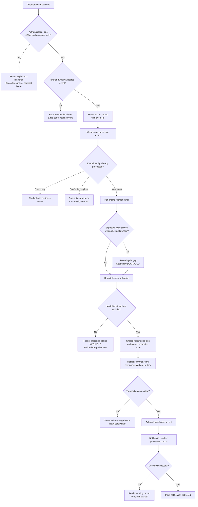
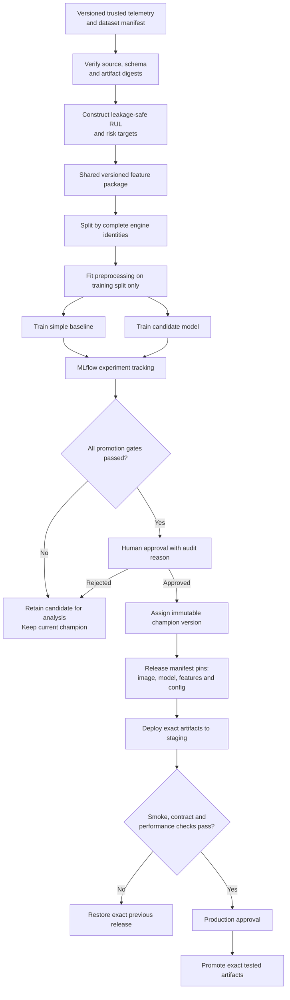
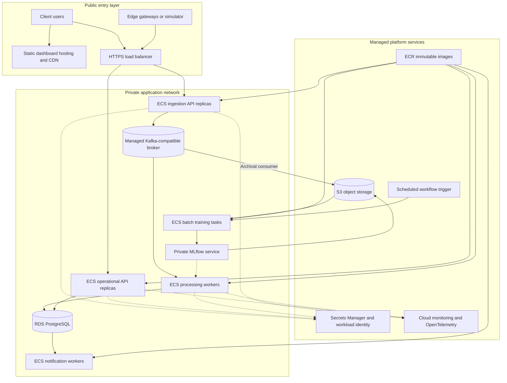

# Phase 3: Target Production Architecture Diagrams

**Status:** Approved 
**Scope:** Target design only. These diagrams include planned components that have not yet been implemented. 
**Current implementation:** The working code currently ends at the validated FD001 interim dataset documented in [Implemented Data Flow](implemented-data-flow.md).

## 1. Logical platform architecture

```mermaid
flowchart LR
    subgraph EDGE[Equipment and edge]
        EQUIPMENT[Engine or telemetry simulator]
        BUFFER[Persistent connectivity buffer]
        EQUIPMENT --> BUFFER
    end

    subgraph ONLINE[Online telemetry and decisions]
        INGEST[FastAPI ingestion API]
        RAW_TOPIC[(telemetry.raw.v1)]
        ARCHIVER[Raw-event archiver]
        WORKER[Modular telemetry-processing worker]
        QUARANTINE[(Quarantine path)]
        DB[(PostgreSQL)]
        OUTBOX[Notification worker]

        INGEST -->|Durable publish| RAW_TOPIC
        RAW_TOPIC --> ARCHIVER
        RAW_TOPIC --> WORKER
        WORKER -->|Invalid or conflicting| QUARANTINE
        WORKER -->|Predictions, alerts and outbox| DB
        DB --> OUTBOX
    end

    subgraph STORAGE[Immutable storage]
        OBJECTS[(S3-compatible object storage)]
        ARCHIVER -->|Batched raw events| OBJECTS
        QUARANTINE -->|Reports and rejected data| OBJECTS
    end

    subgraph CLIENT[Client applications]
        DASHBOARD[React and TypeScript fleet dashboard]
        OPS_API[FastAPI operational API]
        DASHBOARD --> OPS_API
        OPS_API --> DB
    end

    subgraph ML[Offline ML lifecycle]
        AIRFLOW[Airflow training DAG]
        TRAIN[Versioned Python training pipeline]
        MLFLOW[MLflow tracking and registry]
        APPROVAL[Human model approval]

        OBJECTS -->|Trusted versioned data| AIRFLOW
        AIRFLOW --> TRAIN
        TRAIN -->|Runs and artifacts| MLFLOW
        MLFLOW --> APPROVAL
        APPROVAL -->|Champion bundle| MLFLOW
        MLFLOW -.->|Pinned model bundle| WORKER
    end

    subgraph OBS[Cross-cutting controls]
        OTEL[OpenTelemetry]
        MONITORING[Metrics, logs, traces and alerts]
        OTEL --> MONITORING
    end

    BUFFER -->|HTTPS telemetry| INGEST
    INGEST -->|202 only after broker acknowledgement| BUFFER
    WORKER -.-> OTEL
    INGEST -.-> OTEL
    OPS_API -.-> OTEL
    AIRFLOW -.-> OTEL
```

## 2. Online event-processing and failure flow

## 3. Offline training, approval and release flow

## 4. AWS reference deployment

The cloud names describe the reference deployment, not hard dependencies in business logic. Contracts and application interfaces remain portable.
