# Predictive Maintenance Platform: Implemented Flow

This diagram is intentionally limited to the functionality currently present in the repository. The implementation boundary ends at the trusted, validated FD001 Parquet dataset.

## What has been completed

- Phase 1 production problem definition covering users, decisions, inputs, outputs, system boundaries, success metrics, and non-goals.
- A versioned C-MAPSS data contract with canonical telemetry and test-RUL schemas.
- Secure, checksum-verified download of the NASA source archive with temporary-file and atomic-publish behavior.
- Safe extraction of the nested ZIP archives, including CRC, path, member-count, size, compression-ratio, and expected-file checks.
- Source provenance and file integrity tracking through an immutable source manifest.
- Typed parsing of the FD001 train, test, and test-RUL source files.
- Data-quality validation for schema, numeric values, missingness, engine/cycle identity, uniqueness, cycle continuity, fleet counts, and RUL relationships.
- A publication gate that quarantines invalid data and prevents it from entering the trusted interim layer.
- Atomic publication of validated Zstandard-compressed Parquet files, a validation report, and a dataset manifest.
- Idempotent reruns that verify existing artifacts by manifest, size, and SHA-256 before reusing them.
- Unit and integration coverage for the implemented data path; the current suite has 13 passing tests.

## Implemented data flow

```mermaid
flowchart TD
    START([Start]) --> DOWNLOAD[Run data.download]

    subgraph ACQUIRE[1. Acquire the source]
        DOWNLOAD --> ARCHIVE_EXISTS{Valid archive already exists?}
        ARCHIVE_EXISTS -- Yes --> REUSE_ARCHIVE[Reuse verified archive]
        ARCHIVE_EXISTS -- No --> TEMP_DOWNLOAD[Download to temporary .part file]
        TEMP_DOWNLOAD --> CHECK_DOWNLOAD{SHA-256 matches contract?}
        CHECK_DOWNLOAD -- No --> DOWNLOAD_ERROR[Delete temporary file<br/>Raise DatasetDownloadError]
        CHECK_DOWNLOAD -- Yes --> PUBLISH_ARCHIVE[Atomically publish source archive]
        PUBLISH_ARCHIVE --> SOURCE_ARCHIVE[data/raw/cmapss/<br/>nasa_turbofan_outer.zip]
        REUSE_ARCHIVE --> SOURCE_ARCHIVE
    end

    SOURCE_ARCHIVE --> PREPARE[Run data.prepare]

    subgraph EXTRACT[2. Verify and extract raw data]
        PREPARE --> VERIFY_SOURCE{Outer archive SHA-256 valid?}
        VERIFY_SOURCE -- No --> EXTRACTION_ERROR[Raise DatasetExtractionError]
        VERIFY_SOURCE -- Yes --> RAW_EXISTS{Versioned raw extraction exists?}
        RAW_EXISTS -- Yes --> VERIFY_RAW[Verify source manifest,<br/>file sizes, and file hashes]
        VERIFY_RAW --> RAW_READY[Reuse verified raw files]
        RAW_EXISTS -- No --> INSPECT_ZIPS[Inspect outer and nested ZIPs]
        INSPECT_ZIPS --> ZIP_GUARDS[Check CRCs, safe paths, sizes,<br/>compression ratio, and expected members]
        ZIP_GUARDS --> STAGE_RAW[Extract into temporary directory]
        STAGE_RAW --> RAW_MANIFEST[Create source-manifest.json<br/>with provenance and hashes]
        RAW_MANIFEST --> PUBLISH_RAW[Atomically publish versioned raw files]
        PUBLISH_RAW --> RAW_READY
    end

    subgraph PREPARE_DATA[3. Parse and validate FD001]
        RAW_READY --> INTERIM_EXISTS{Trusted FD001 publication exists?}
        INTERIM_EXISTS -- Yes --> VERIFY_INTERIM[Verify dataset manifest,<br/>source identity, sizes, and hashes]
        VERIFY_INTERIM --> REUSE_INTERIM[Return existing verified dataset manifest]
        INTERIM_EXISTS -- No --> PARSE_TRAIN[Parse train_FD001.txt]
        INTERIM_EXISTS -- No --> PARSE_TEST[Parse test_FD001.txt]
        INTERIM_EXISTS -- No --> PARSE_RUL[Parse RUL_FD001.txt]
        PARSE_TRAIN --> TYPED_TABLES[Canonical typed Polars tables]
        PARSE_TEST --> TYPED_TABLES
        PARSE_RUL --> TYPED_TABLES
        TYPED_TABLES --> QUALITY[Run schema, value, missingness,<br/>identity, cycle, fleet, and RUL checks]
        QUALITY --> PUBLICATION_GATE{Publication status acceptable?}
    end

    subgraph PUBLISH[4. Gate and publish trusted data]
        PUBLICATION_GATE -- Failed or unapproved warnings --> QUARANTINE[Write quarantine validation report<br/>and rejected records when present]
        QUARANTINE --> BLOCK[Stop trusted publication<br/>Raise DatasetPreparationError]
        PUBLICATION_GATE -- Passed or explicitly allowed warnings --> STAGE_INTERIM[Stage Zstandard Parquet files<br/>and validation JSON]
        STAGE_INTERIM --> DATASET_MANIFEST[Create dataset-manifest.json<br/>with schemas, source identity, and hashes]
        DATASET_MANIFEST --> ATOMIC_INTERIM[Atomically publish trusted FD001 directory]
        ATOMIC_INTERIM --> OUTPUTS[train.parquet: 20,631 rows<br/>test.parquet: 13,096 rows<br/>test-rul.parquet: 100 rows<br/>validation-report.json<br/>dataset-manifest.json]
    end

    REUSE_INTERIM --> END([Trusted FD001 data ready])
    OUTPUTS --> END
```

## Current implementation boundary

The working system currently produces a reproducible, integrity-checked, quality-gated FD001 dataset under `data/interim/cmapss/v1/fd001/`. This is the input foundation for later project phases; those later phases are deliberately excluded from this diagram because they have not been implemented yet.
