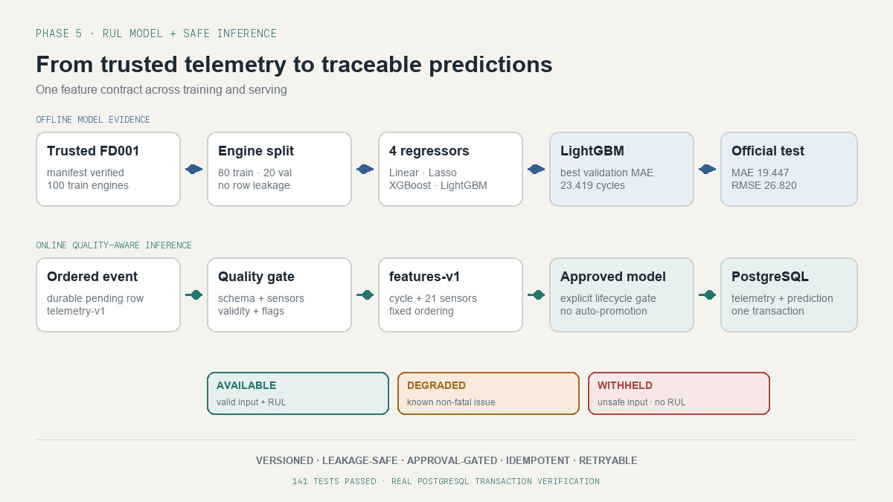

# Phase 5: Feature Generation, RUL Modelling, and Inference

**Status:** Completed<br>
**Project:** AeroReliability Predictive Maintenance Platform<br>
**Dataset:** NASA C-MAPSS FD001<br>
**Feature contract:** `features-v1`<br>
**Training run:** `fd001-four-model-regression-v2`<br>
**Completion date:** 2026-09-16<br>
**Serving state:** No model has been approved for production serving

## 1. Objective

Build the complete path from trusted engine telemetry to a traceable Remaining
Useful Life prediction.

This phase had to answer six practical questions:

1. Which exact values and ordering does the model receive?
2. How is RUL calculated without leaking information between engines?
3. Which model performs best when every candidate uses the same split and metrics?
4. When is an input safe to score, degraded but usable, or unsafe to score?
5. How are predictions stored without duplication or silent overwrites?
6. What happens when model execution or database persistence fails?

The result is a versioned feature contract, a reproducible four-model experiment,
a quality-aware inference worker, and an atomic PostgreSQL processing path connected
to the ordered telemetry consumer.

## 2. Delivered outcome

Phase 5 implements the following flow:

```text
trusted FD001 data
      -> leakage-safe RUL targets
      -> features-v1
      -> train and compare four regressors
      -> immutable experiment winner

ordered telemetry event
      -> telemetry/data-quality decision
      -> features-v1 builder
      -> explicitly approved predictor
      -> AVAILABLE / DEGRADED / WITHHELD prediction
      -> idempotent PostgreSQL persistence
```

The offline and online paths share the same feature names, order, and version. The
online worker cannot automatically serve the experiment winner: it loads only an
artifact whose manifest has been explicitly marked `approved`.



## 3. Daily implementation record

| Day | Outcome |
| --- | --- |
| Day 1 | Defined inference input, prediction output, quality states, lineage, idempotency, and last-valid behavior. |
| Day 2 | Created the versioned `FeatureVector` contract and finite-value validation. |
| Day 3 | Implemented deterministic `features-v1` construction. |
| Day 4 | Added model artifact lifecycle rules, approved-only loading, and the model-independent predictor interface. |
| Day 5 | Trained and compared Linear Regression, Adaptive Lasso, XGBoost, and LightGBM. |
| Day 6 | Implemented quality-aware inference, atomic persistence, consumer integration, and PostgreSQL verification. |

The detailed Day 5 experiment is retained in
[Phase 5, Day 5: RUL Model Training and Comparison](05-day5-baseline-rul-model.md).
The original design contract is retained in
[Phase 5: Inference Contract](05-inference-contract.md).

## 4. Feature contract

`features-v1` contains 22 values in a fixed order:

```text
cycle, sensor_1, sensor_2, ..., sensor_21
```

The feature contract stores three things together:

- `feature_version`
- ordered `feature_names`
- ordered numeric `values`

The builder rejects:

- A non-positive cycle.
- A missing required sensor.
- A null required sensor.
- NaN or infinite values.
- Feature-name and value-length mismatches.

Feature ordering is part of correctness. A numeric array with the right length but
the wrong column order can produce a believable and incorrect prediction, so the
runtime predictor verifies both `feature_version` and the complete ordered name
tuple before executing the model.

This first feature version intentionally uses current-cycle values. Rolling windows,
slopes, and more advanced transformations require a new version rather than a
silent change to `features-v1`.

## 5. RUL target and leakage control

For a training engine observed through failure:

```text
RUL at the current row = maximum cycle for that engine - current cycle
```

For example, if an engine fails at cycle 100:

| Current cycle | Training target |
| ---: | ---: |
| 70 | 30 cycles |
| 99 | 1 cycle |
| 100 | 0 cycles |

The target and RUL refer to the same quantity. `rul_cycles` is the stored target
column during training and the estimated quantity during inference. Negative model
outputs are postprocessed to zero because negative remaining life has no operational
meaning.

The `cycle` column is the sequential observation number for one engine. It provides
the engine's current position in its operating history and helps calculate the
historical label. It is not itself an RUL value. Evaluation compares predicted RUL
with `maximum engine cycle - current cycle`, never with the current cycle number.

The split is made by complete engine identity, not by randomly splitting rows:

| Partition | Engines | Rows |
| --- | ---: | ---: |
| Training | 80 | 16,561 |
| Validation | 20 | 4,070 |

All cycles from one engine stay together. This prevents the model from training on
earlier cycles of an engine and being validated on later cycles of that same engine.
The official FD001 test set remains separate from model selection.

## 6. Models compared

The same feature contract, engine split, random seed, and validation rows were used
for all candidates.

### Linear Regression

A simple, interpretable reference model using:

```text
StandardScaler -> LinearRegression
```

### Adaptive Lasso

The implementation first fits Ridge regression to obtain stable initial
coefficients. It then calculates a feature-specific penalty:

```text
weight_j = 1 / (abs(initial_coefficient_j) + epsilon)^gamma
```

Lasso is fitted on the weighted features, applying stronger penalties to features
with smaller initial coefficients.

### XGBoost

A gradient-boosted tree regressor using a squared-error objective and deterministic
training settings.

### LightGBM

A histogram-based gradient-boosted tree regressor configured with deterministic
training settings. It achieved the lowest validation MAE and became the experiment
winner.

## 7. Evaluation policy and measured results

Every candidate is measured with scikit-learn MAE and RMSE plus the NASA asymmetric
score.

- **MAE** gives the average absolute error in cycles.
- **RMSE** penalises larger errors more strongly.
- **NASA score** penalises late predictions more heavily because overestimating RUL
  can delay inspection.

Failure-risk classification and alert-threshold metrics are deferred until a later
phase defines the operational policy. They are not part of this regression
experiment.

The declared ranking policy is:

1. Lowest validation MAE.
2. Lowest NASA score if MAE is tied.
3. Lowest RMSE if MAE and NASA score are tied.
4. Model name as a deterministic final tie-break.

### Validation ranking

| Rank | Model | MAE | RMSE | NASA score |
| ---: | --- | ---: | ---: | ---: |
| 1 | LightGBM | 23.419 | 30.821 | 270,305.533 |
| 2 | XGBoost | 23.638 | 31.171 | 313,218.453 |
| 3 | Linear Regression | 24.454 | 31.231 | 302,723.135 |
| 4 | Adaptive Lasso | 24.478 | 31.254 | 302,582.511 |

After selection, LightGBM was retrained on all 100 training engines and evaluated
once on the official 100-engine test set:

| Metric | Official test result |
| --- | ---: |
| MAE | 19.447 cycles |
| RMSE | 26.820 cycles |
| NASA score | 8,065.366 |

The validation NASA scores are much larger because validation contains 4,070
cycle-level predictions, while the official test contains one final observation for
each of 100 engines. The score is a sum, so values from different sample counts
must not be compared directly.

## 8. Immutable experiment publication

The completed run is stored at:

```text
artifacts/training-runs/fd001-four-model-regression-v2/
```

It contains:

- `evaluation.json`: dataset identity, manifest checksum, feature contract, engine
  split, selection policy, candidate results, and official test result.
- `selected-model.joblib`: LightGBM retrained on all training engines.

Publication is staged and renamed atomically. Reusing an existing run name fails,
so previous evidence cannot be silently overwritten.

The selected model is an experiment winner. It is not an approved serving release.
Production packaging and human approval remain explicit lifecycle steps.

## 9. Model artifact and serving gate

The serving manifest records:

- Model release identifier.
- Feature version.
- Training dataset version.
- Model and scaler paths.
- Evaluation MAE.
- Lifecycle state: `candidate`, `approved`, or `retired`.

The loader performs these checks before deserialising model files:

1. The manifest is readable and valid.
2. Its lifecycle state is `approved`.
3. Model and scaler artifacts exist.
4. Its feature version matches the runtime feature version.

The fitted scaler is reused during inference and is never refitted on live data.
The consumer activates model inference only when
`PM_APPROVED_MODEL_MANIFEST_PATH` points to an approved release.

## 10. Inference contracts and decisions

### Input contract

Each inference input contains:

- Event, engine, and cycle identity.
- Telemetry schema version.
- Sensor measurements.
- Data-quality status.
- Quality flags.

Unexpected fields are rejected. The canonical schema is `telemetry-v1`.

### Prediction contract

Each prediction contains:

- Event, engine, and cycle identity.
- Estimated RUL when available.
- Prediction status.
- Data-quality status and flags.
- Model release and feature version.
- Generation timestamp.

The contract enforces that `WITHHELD` has no estimated RUL and that `AVAILABLE` or
`DEGRADED` always has one.

### Decision behavior

| Condition | Result | Model called? |
| --- | --- | --- |
| Supported schema, valid data, complete finite features | `AVAILABLE` | Yes |
| Non-fatal quality warning, complete finite features | `DEGRADED` | Yes |
| Invalid data quality | `WITHHELD` | No |
| Incompatible schema | `WITHHELD` | No |
| Missing, null, or non-finite required feature | `WITHHELD` | No |
| Model exception or invalid model output | Retryable execution error | Attempted |

A bad business input becomes an explicit withheld record. A transient model failure
does not become `WITHHELD`, because that would incorrectly describe a system failure
as a data decision. It raises an execution error and remains retryable.

## 11. Idempotent prediction persistence

The prediction business identity is:

```text
(event_id, model_release)
```

Persistence returns one of three outcomes:

- `INSERTED`: no prediction existed for that event and model release.
- `DUPLICATE`: an exact business-content retry was received.
- `CONFLICT`: the same identity arrived with changed prediction content.

`generated_at` is intentionally excluded from duplicate comparison because a retry
may recreate the same decision at a different wall-clock time. RUL, prediction
status, feature version, data-quality status, and flags must still match. A conflict
does not overwrite the original record.

## 12. Last-valid prediction behavior

When the current event is withheld, the platform can retrieve the most recent
`AVAILABLE` or `DEGRADED` prediction for the same engine and model release.

The lookup:

- Excludes withheld rows.
- Requires a non-null RUL.
- Never crosses model-release boundaries.
- Orders by engine cycle, generation time, and prediction identity.

The dashboard can later show this record only as historical context, for example:

```text
Current prediction: unavailable
Last valid RUL: 26 cycles at cycle 81
Current reason: required sensor missing at cycle 82
```

An older prediction must never be presented as current.

## 13. Transaction and retry behavior

The ordered consumer routes released events through
`TransactionalInferenceProcessor`. One PostgreSQL transaction performs:

1. Telemetry persistence and quality resolution.
2. Inference-input construction.
3. Feature building and model execution.
4. Prediction persistence.

If model execution or prediction persistence fails, the telemetry insert rolls back
with the prediction. The durable `pending_event` remains available for retry. After
a successful commit, the pending row is removed.

If the same event is processed after a crash between database commit and cleanup,
telemetry and prediction uniqueness constraints turn the retry into a safe duplicate.

## 14. Database changes

Migration `0004_prediction_lineage` adds these columns to `prediction`:

- `feature_version`
- `data_quality_status`
- `quality_flags` as a JSON array

Existing rows are backfilled before the new non-null constraints are applied. The
migration also validates the allowed quality states and the JSON array shape.

The earlier Alembic revision chain was repaired so migrations now form one complete
history ending at:

```text
0004_prediction_lineage (head)
```

## 15. Implementation map

| Module | Responsibility |
| --- | --- |
| `features/contracts.py` | Feature version, canonical order, shape, and finite-value contract |
| `features/builder.py` | Deterministic conversion from telemetry measurements to `features-v1` |
| `training/data.py` | Manifest verification, RUL labels, official test loading, and engine-level split |
| `training/models.py` | Linear Regression, Adaptive Lasso, XGBoost, and LightGBM definitions |
| `training/evaluate.py` | MAE, RMSE, NASA score, and regression result contracts |
| `training/train.py` | Candidate comparison, selection, official test evaluation, and immutable publication |
| `inference/artifacts.py` | Serving manifest and approved-only artifact loading |
| `inference/predictor.py` | Model-independent RUL predictor interface |
| `inference/sklearn_predictor.py` | Runtime model/scaler adapter and feature compatibility checks |
| `inference/contracts.py` | Inference input and prediction output contracts |
| `inference/worker.py` | Quality gates, feature building, prediction, and withheld decisions |
| `inference/processor.py` | Atomic telemetry-to-prediction orchestration |
| `storage/predictions.py` | Idempotent prediction storage and last-valid lookup |
| `streaming/consumer.py` | Ordered-event routing and approved-model activation |

## 16. Operating commands

Run a new immutable model comparison:

```bash
.venv/bin/pm-platform model train-compare \
  --run-name fd001-four-model-v2
```

Start PostgreSQL and apply migrations:

```bash
docker compose up -d postgres
.venv/bin/alembic upgrade head
.venv/bin/alembic current
```

Run the complete verification suite:

```bash
.venv/bin/pytest -q
.venv/bin/ruff check src tests infrastructure/postgres/migrations
.venv/bin/mypy src
```

After a model has been packaged and explicitly approved, configure the consumer:

```bash
export PM_APPROVED_MODEL_MANIFEST_PATH=artifacts/<approved-release>/manifest.json
.venv/bin/pm-platform stream worker
```

A candidate manifest fails the approval gate and cannot start the inference path.

## 17. Verification evidence

At phase completion:

- The four-model comparison ran against the trusted FD001 publication.
- The selected LightGBM model was evaluated once on the official test set.
- Migration `0004_prediction_lineage` was applied to local PostgreSQL.
- PostgreSQL tests verified insert, exact duplicate, conflict, last-valid lookup,
  atomic commit, and rollback after model failure.
- `pytest`: 141 tests passed with all PostgreSQL integration tests executed.
- Ruff: all lint checks passed.
- Strict Mypy: no issues found in 37 source files.

## 18. Boundaries and remaining work

Phase 5 does not implement:

- Promotion of the experiment winner to an approved production release.
- MLflow tracking or model registry integration.
- Failure-risk classification, alert thresholds, and classification metrics.
- Fleet and engine-detail APIs.
- Dashboard presentation of current and last-valid predictions.
- Airflow orchestration.
- Drift, latency, and prediction-distribution monitoring.
- Cloud deployment.

The C-MAPSS dataset is simulated. These results demonstrate the engineering and
evaluation process; they do not establish safety or performance on real equipment.

## 19. Completion decision

Phase 5 is accepted because training and inference now share a versioned feature
contract, model comparison is reproducible and leakage-safe, serving is protected by
an explicit approval gate, unsafe inputs are withheld, degraded inputs remain
visible, predictions are traceable and idempotent, failures remain retryable, and
the transaction behavior has been verified against PostgreSQL. This accepts the
Phase 5 engineering implementation; it does not automatically approve LightGBM for
production.

The next phase will enforce regression promotion rules, track experiments and
registry state, and package the candidate for review. Promotion will remain explicit
and will require the candidate to satisfy the agreed gates.
